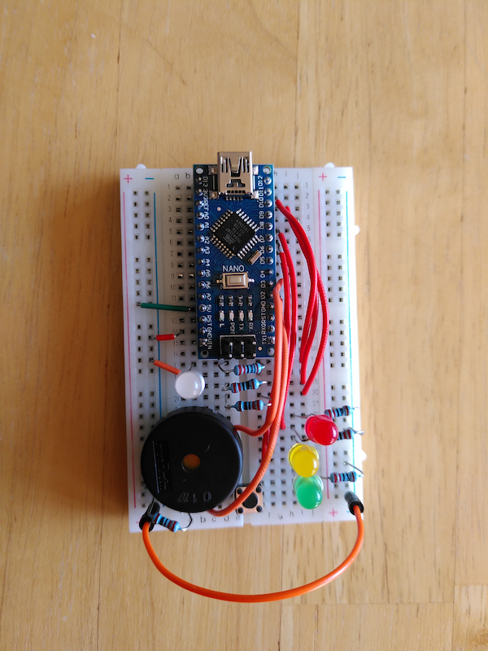
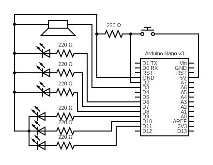

# arduino-pomodoro-timer
a small personal hardware helper

## Components
* 1 Arduino Nano v3 or compatible microcontroller
* 1 breadboard (400 holes or larger)
* Connection wires
* 1 RGB LED (common cathode)
* 1 red LED
* 1 yellow LED
* 1 green LED
* 1 push button
* 1 piezo
* 7 220 Ω resistors
